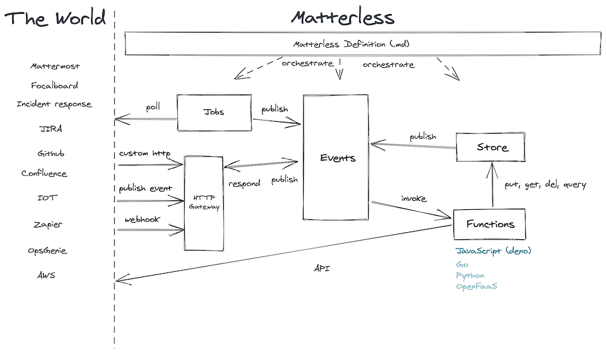

# Matterless: putting serverless on your server
[Serverless computing](https://en.wikipedia.org/wiki/Serverless_computing) enables you to build applications that automatically scale with demand, and your wallet. Within seconds, serverless application can scale from handling 0 requests per day to thousands of requests per second. This is the power of the cloud at its best.

But, **what if** all you want is check open pull requests on your Github repo at 9am every morning, and send a reminder message on your team’s chat channel?

**What if** you want to create a chat bot that adds a “high five” reaction to any message containing the phrase “high five”?

**What if** all you want to do is blink your smart lights whenever your backup drive runs out of disk space?

**What if** you’re too lazy to create an AWS, Azure or GCP account or scared to connect it to your credit card?

**What if** you have a Raspberry Pi sitting in your closet that’s not doing anything useful, or you were looking for a quasi-valid reason to buy one? 

**What if** you prefer to be in full control of your code, infrastructure and data?

_Matterless_ may just be what you've been waiting for all this time.

Matterless brings the serverless programming model to your own server, laptop or even Raspberry Pi. It is simple to use, fast to deploy, and... let's just call a spade a spade, it's _awesome_.

Why?

1. Matterless is distributed as a **single binary** with no required dependencies (Matterless relies on [Deno](https://deno.land/) as its main runtime, but will download it on-the-fly).
2. Matterless requires **zero configuration**  to run (although it does give you options).
3. Matterless is **light-weight**: it runs fine on a Raspberry Pi. There's no fancy container orchestration, Kubernetes or firecrackers involved.
4. Matterless enables **extremely rapid iteration**: Matterless applications tend to (re)deploy within a second or two. A common mode of development is to have Matterless watch for file changes and reload on every file save.

Matterless is not attempting to be a replacement for AWS, Azure or GCP. If you need to scale from 0 to thousands of requests per second, Matterless likely won't cut it. Matterless' sweet spot is likely in building scratch-your-own-itch micro applications you may have a need for, but wouldn't require the extreme scalability the full cloud provides.

Nevertheless, its programming model is serverless-esque, because you...

* Use Matterless **functions** to respond to events.
* Use Matterless **events** to glue different parts of your application together.
* Use the Matterless **store API** (a simple key-value store) to store persistent application data.
* (Coming soon) Use Matterless **queues** to schedule work to be performed asynchronously.



[ExcaliDraw](https://excalidraw.com/#json=4902067223134208,3wzTFbbenppiu7dMeagypw)

In addition, to enable extending Matterless in Matterless (it’s [Matterless all the way down](https://en.wikipedia.org/wiki/Turtles_all_the_way_down)), Matterless adds:

* Matterless **jobs** to write code that runs continuously in the background and connects with external systems, generally exposing anything interesting inside your application as events (e.g. via a (web)socket connection, or polling).
* A **macro system** based on [Go template](https://golang.org/pkg/text/template/) syntax to create new, higher-level definition types (we’ll get to that).

Under the hood, Matterless relies on the following technologies:

1. Matterless is written in [Go](https://golang.org/).
2. Its data store uses LevelDB (in fact [its Go implementation](https://github.com/syndtr/goleveldb)) under the hood. 
3. Matterless' default runtime is [Deno](https://deno.land). Deno runs JavaScript and Typescript code in a secure sandbox. Therefore, functions and jobs don't have access to the local file system and cannot spawn local processes. And don't worry, you don't need to have Deno installed, it will be downloaded automatically for you on first launch. In the future other runtimes will be supported.

Sounds interesting? You would be correct. You have good judgement.

## What is a Matterless application
A Matterless application consists of declarative _definitions_ written in a _matterless definition_ file. One matterless definition file defines one application, although you can import other files via URLs. Naturally, matterless definition files use the `.md` file extension. You may think: "Hey, but that’s already used by Markdown!" Conveniently, Matterless' application format **is** markdown with specific semantics, so that all works out well — and it looks great when rendered on Github (and ultimately it's all about what code looks like on Github).

In principle, arbitrary Markdown is allowed in a `.md` file and Matterless will accept it. Documenting your application this way is encouraged. It looks like [literate programming](https://en.wikipedia.org/wiki/Literate_programming) is finally coming to fruition (you’re welcome, Donald).

However, when you use headers (`#` nested at any level) _and_ the first word of the header starts with a lowercase letter (which is a big no in regular writing anyway, capitalize your headers, people!), Matterless interprets it as a Matterless definition.

So. This is the point in the README where it is revealed that the README.md file you're reading right now, is in fact a valid and even somewhat useful Matterless application! Try it out with `mls run README.md`!

I'll wait until you put together your mind, which has just been blown.

## Back to the primitives

Matterless currently supports the following **core primitive definition types**:

* `function` (or `func` if you're lazy): for defining short-running functions that can be triggered e.g. when certain events occur.
* `job`: for defining long-running background processes that for instance connect to external systems, and trigger events as a result.
* `events`: for mapping events to functions to be triggered. There are certain built-in events that will automically trigger under certain conditions (e.g. when writing to the data store, or when certain URLs are called on Matterless’s HTTP Gateway).
* `macro`: for defining new abstractions that map to a combination of existing matterless definitions.
* `imports`: for importing externally defined (addressed via URLs) matterless definitions into your application (often used to import macros).

In addition, defined macros can of course be instantiated.

## Matterless APIs
Inside of `function` and `job` code (which in the future will be able to use multiple runtimes, but use Deno for now), you have access to a few [Matterless APIs](https://github.com/zefhemel/matterless/blob/master/pkg/sandbox/deno/matterless.ts):

* `store`: a simple key-value store with the following operations:
    * `store.put(key, value)` a specific value for a key.
    * `store.get(key)` to fetch the value for a specific key.
    * `store.del(key)` to delete a key from the database.
    * `store.queryPrefix(prefix)` to fetch all keys and their values prefixed with `prefix`.
* `events`: to publish events and respond to them (in an RPC setup):
    * `events.publish(eventName, eventData)` to publish a custom event (that can be listened to via a `event` definition in your definition file).
    * `events.respond(toEvent, eventData)` to respond to a specific event (currently only used to respond to HTTP request events).
* `functions`: invoke other functions by name (rarely needed, but supported)
   * `functions.invoke(functionName, eventData)` invoke function `functionName` with `eventData`.

But any arbitrary deno libraries can be imported as well.

## Matterless 101

Here is "Hello world" in Matterless:

----
    # function HelloWorld
	```javascript
    function handle(event) {
        console.log("Hello world!");
    }
    ```
----

Save this to `hello.md` and run it as follows:

```shell
$ mls run hello.md
```

This will do shockingly little, because nothing is invoking this function yet. However, Matterless comes with a simple console we can use to manually invoke this function (if you don't see the `hello>` prompt hit Enter first).

We can manually invoke our function with an empty event as follows:

```
hello> invoke HelloWorld {}
```

This will print something along the lines of:

```
INFO[0015] [App: hello | Function: HelloWorld] Starting deno function runtime. 
INFO[0016] [App: hello | Function: HelloWorld] Hello world! 
```

Success!

For the remainder of this README Matterless definitions will be inlined as Markdown, so they're easier to read.

Let's look at the function definition type and other support definition types more closely.

# Matterless Definition Types
These are the _definition types_ currently supported and how to use them.

## function MyFunction
As of this writing, JavaScript is the primary supported language. More runtimes (based on docker) will be added in the future.

The JavaScript function that will be invoked needs to be called `handle` and take a single argument: `event`, which will receive event data (depending on how the function will be triggered) and may or may not return a result.

While technically in most cases a Deno process instance with your function code inside it will be reused (it's not relaunched for every invocation), you should assume a stateless environment. While technically you have full access to all Deno APIs, your function may be killed at any time along with all its in-memory and disk state. In fact, in the current implementation will indeed happen after a brief amount of time of inactivity.

A function definition may contain an optional configuration YAML block:

```yaml
init:
   name: Donald Knuth
runtime: deno
```

The values put into `init` (which usually would be an object, but it could be an YAML array as well) will be passed to the `init` JavaScript function upon cold start:

```javascript
function init(config) {
    console.log(`Hello there, I'm initing for ${config.name}`);
}

function handle(event) {
    console.log("I was just run with", event);
}
```

When first invoked, this will log something along the lines of:

    INFO[0017] [App: README | Function: MyFunction] Hello there, I'm initing for Donald Knuth
    INFO[0017] [App: README | Function: MyFunction] I was just run with {}

Subsequent invocations will skip the initialization.

## job StarGazerPoll
Jobs are much like `function`s, except they boot up immediately upon the application start and keep running during the lifetime of the application. Like `function`s, jobs support an optional YAML configuration block:

```yaml
init:
   repo: zefhemel/matterless
   pollInterval: 60
   event: starschanged
```

Rather than implementing the `handle` JavaScript function, a job implements `start` and (optionally) `stop`.

In this example we're going to poll the Github API every 60 seconds to see if the number of stars on the matterless repository has changed and publishing a `starschanged` event when it does. Note that this example uses various core Matterless APIs: `store` and `events` to track state between runs. Theoretically a global variable could be used, but this value would be lost between restarts of the app:

```javascript
import {store, events} from "./matterless.ts";

let config;

function init(cfg) {
    console.log("Inited with", cfg);
    config = cfg;
}

function start() {
    setInterval(async () => {
        // Pull old star count from the store (or set to 0 if no value)
        let oldStarCount = (await store.get("stars")) || 0;
        
        // Talk to Github API to fetch new value
        let result = await fetch(`https://api.github.com/repos/${config.repo}`);
        let json = await result.json();
        let newCount = json.stargazers_count;
        
        // It changed!
        if(newCount !== oldStarCount) {
            // Publish event
            await events.publish(config.event, {
                stars: newCount
            });
            // Store new value in store
            await store.put("stars", newCount);
        } else {
            console.log("No change :-(");
        }
    }, config.pollInterval * 1000);
}

function stop() {
    console.log("Shutting down stargazer poller");
}
```

## events
Using events mappings we define which events should invoke which functions. Multiple functions can be invoked in response to a single event, therefore we specify them as a list:

```yaml
starschanged:
  - StarGazeReporter
http:GET:/myAPI:
  - MyHTTPAPI
```

## function StarGazeReporter
```javascript
function handle(event) {
    console.log("Number of stars changed to", event.stars);
}
```

## System events

### HTTP Events
Matterless always spins up a HTTP server. This server serves multiple purposes:
1. It allows a Matterless client to talk to a Matterless server, e.g. to deploy new applications, update them, delete them.
2. It exposes built-in APIs to Matterless applications, such as for the data store, events and function invocation.
3. Matterless applications can expose  custom HTTP endpoints, e.g. to be called by outside systems such as webhooks. 

This section is how to achieve that last one: create your own custom HTTP endpoints for your matterless application.

All you need to do is listen to an event of a certain pattern, e.g. `http:GET:/myAPI`, which will be invoked when requesting, in this case: `http://localhost:8222/README/myAPI`. The pattern being: `$yourmatterlessserver/$appname/path`. HTTP events are named following the pattern `http:$method:$path`. The function that is triggered needs to respond to the event using the `events.respond` API as demonstrated bellow:

#### function MyHTTPAPI
```javascript
import {events} from "./matterless.ts";

function handle(req) {
    events.respond(req, {
        status: 200,
        body: "Hello there!"
    });
}
```

This uses the `events.respond` call, which effectively pulls a special event-response name from the request event, and publishes the response on it. In your response object you can specify:

* `status`: a HTTP status code
* `headers`: an object with headers (e.g. `{"Content-type": "application/json"}`)
* `body`: either as a string or as an object, in which case it will be JSON encoded

The `req` event here will contain request data:

* `path`: the URL path
* `method`: the HTTP request method
* `headers`: an object with headers
* `request_params`: containing an object with request parameters (e.g. `?name=bla` would result in `{name: "bla"}`)
* `form_values`:when posted as `application/x-www-form-urlencoded`
* `json_body`: when posted as `application/json`

### Store events
Whenever a key is *put* or *deleted* from the store, an event is triggered with the pattern `store:put:$key` and `store:del:$key` containing the `key` and `new_value` (in case of puts) as data in the event. You can subscribe to specific updates to keys, or use the wildcard `*` notation to be notified of all changes to keys matching a certain pattern (in this case when any change is made to a key starting with `config:`):

#### events
```yaml
store:put:config:*:
- ConfigChanged
```

#### function ConfigChanged
```javascript
function handle(event) {
    console.log(`Config key ${event.key} was changed to "${event.new_value}"!`);
}
```

Try it to see that this works via the mls console:

	README> put config:myRandomConfig "Matterless is cool"

Which should log something along the lines of

	INFO[0014] [App: README | Function: ConfigChanged] Starting deno function runtime. 
	INFO[0014] [App: README | Function: ConfigChanged] Config key config:myRandomConfig was changed to "Matterless is cool"! 


## macro httpApi
What makes Matterless really powerful is the ability to add new definition types using Matterless itself.

The idea is simple, yet powerful. You define a macro, and define its inputs (the YAML attributes that need to be passed to instantiate it) using YAML schema (which is really JSON schema encoded in YAML). 

Let me explain this with a simple example. Let's say you don't like the event notation to create HTTP endpoints, and would like to introduce a specialized "httpApi" definition type that is nicer to read and write. We can achieve this as follows.

First we define the input schema:

```yaml
input_schema:
  type: object
  properties:
    path:
      type: string
    method:
      type: string
    function:
      type: string
  required:
    - path
    - method
    - function
```

This specifies the `httpApi` macro takes three required properties:

* `path` (the URL path to match), a string
* `method` (the HTTP method), also a string
* `function` the Matterless function to trigger when the endpoint is called.

Then, we define a template to translate this using the [Go template syntax](https://golang.org/pkg/text/template/). Inside this template we can use two special variables: `$name` which will contain the name of the template definition (e.g. when we create `httpApi MyAPI` then `$name` will contain `MyAPI`), and `$input` which will contain all input properties.

Here is the template:

    ## events
    ```yaml
    "http:{{$input.method}}:{{$input.path}}":
    - {{$input.function}}
    ```

That's all, now we can use it:

## httpApi MyAPI
```yaml
path: /anotherAPI
method: GET
function: MyHTTPAPI
```

Now, simply visit http://localhost:8222/README/anotherAPI to see that it works!

Need more? Have a look at the [samples](https://github.com/zefhemel/matterless/tree/master/samples) and the start of a Matterless [standard library](https://github.com/zefhemel/matterless/tree/master/lib) of macros.

# Installing Matterless
Requirements:
* Go 1.16 or newer

Tested on Mac (Apple Silicon) and Linux (AMD64), although other platforms should work as well.

```shell
$ go get github.com/zefhemel/matterless/...
$ go install github.com/zefhemel/matterless/cmd/mls@latest
````

This will install the binaries in your `$GOPATH/bin`.

# Running Matterless
Matterless has three modes of operation:

1. All-in-one mode via `mls run`, this will run both the server and client in a single process. This is useful for development, especially with the `-w` option that watches the files you point to for changes:
    ```shell
   $ mls run -w myapp.md 
   ```
   It will also immediately kick you into the Matterless console, which allows you to manually trigger events, invoke functions and perform various store operations.
2. Server mode by simply running `mls` optionally with arguments like `-p` to bind to a specific port (defaults to `8222`), `--data` to select the data directory (default: `./mls-data`) and `--token` to use a specific admin token (generates one by default):
    ```shell
    $ mls --data /var/data/mls 
    ```
3. Client/deploy mode to deploy code to a remote (or local) matterless server:
    ```shell
    $ mls deploy --url http://mypi:8222 --token mysecrettoken -w myapp.md
    ```

Enjoy!
